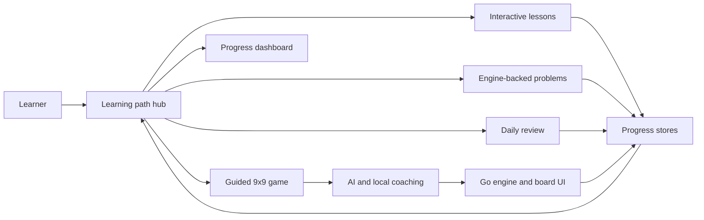

# Go Sensei Wiki

Go Sensei is an AI Go tutor built around four major dimensions:

1. Learner experience and product loop
2. Curriculum, practice, and progress model
3. AI coaching and tutoring system
4. Go engine and application architecture

This wiki is the root project orientation. Each article explains one dimension from the perspective of how the product works, which files own the behavior, and what future work should protect.

## Current Status - 2026-06-19

Observed project state from the `codex/project-wiki-overview` worktree after PR #309 fixed the dependency audit blocker:

- Main commit reviewed: `1284b45bc4b55bf3efad3c90b3129e99b3fa10d0` (`Fix dependency audit advisories`).
- Latest observed main CI: success on GitHub Actions run `27808961043`, created `2026-06-19T06:12:52Z`, for commit `1284b45bc4b55bf3efad3c90b3129e99b3fa10d0`.
- Package version: `0.1.0` in `package.json`.
- Release gate script: `npm run release:check`, which runs lint, Vitest, production build, and high-severity audit.
- Release-gate status: passing on current main after the audit fix; CI ran lint, Vitest, build, and high-severity audit successfully.
- Release readiness: not tag-ready for `v1.0.0` until version metadata, production OAuth, production smoke, and release-note evidence are complete.

The project should not be tagged `v1.0.0` until the release PR records the missing evidence called out in [docs/release/1.0.0-readiness.md](../docs/release/1.0.0-readiness.md):

- `package.json` is bumped to `1.0.0` in the actual release PR.
- The candidate PR is ready, merged to `main`, and has passing GitHub checks.
- Production OAuth uses a dedicated `GITHUB_OAUTH_CLIENT_ID`.
- Production smoke evidence records the deployed board load, GitHub device login flow, production OAuth config failure mode, and first beginner guided-game move.
- [docs/release/v1.0.0-notes.md](../docs/release/v1.0.0-notes.md) has final verification evidence, not placeholders.
- The release PR keeps `npm run release:check` green at tag time.

## Article Map

| Dimension | Article | What it covers |
| --- | --- | --- |
| Learner experience | [Learner Experience and Product Loop](learner-experience.md) | The first screen, app phases, guided game, path hub, lessons, problems, review, dashboard, and game review. |
| Learning model | [Curriculum, Practice, and Progress Model](curriculum-practice-progress.md) | Lessons, problems, concept mastery, spaced review, recommendation order, and dashboard progress. |
| AI tutoring | [AI Coaching and Tutoring System](ai-coaching-system.md) | GitHub auth, Copilot session exchange, OpenAI Responses API, tool calls, local fallbacks, and action routing. |
| Architecture | [Go Engine and Application Architecture](go-engine-application-architecture.md) | Pure TypeScript Go engine, Zustand stores, Next.js structure, overlays, persistence, tests, and release checks. |

## One-Screen Mental Model

The center of gravity is not the chat box. The app is a structured practice loop: choose the next useful activity, make the learner prove the idea on the board, record evidence, and use that evidence to recommend the next move.

## Source Pointers

- Main shell: [src/app/page.tsx](../src/app/page.tsx)
- Game state and navigation: [src/stores/game-store.ts](../src/stores/game-store.ts)
- Learning recommendations: [src/lib/learning-path/recommendations.ts](../src/lib/learning-path/recommendations.ts)
- AI chat route: [src/app/api/chat/route.ts](../src/app/api/chat/route.ts)
- Go engine public API: [src/lib/go-engine/index.ts](../src/lib/go-engine/index.ts)
- Release readiness: [docs/release/1.0.0-readiness.md](../docs/release/1.0.0-readiness.md)
